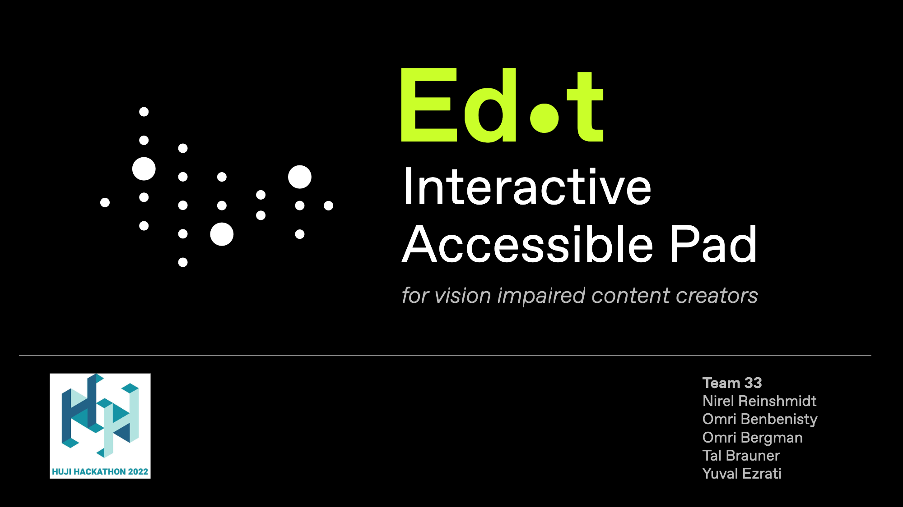
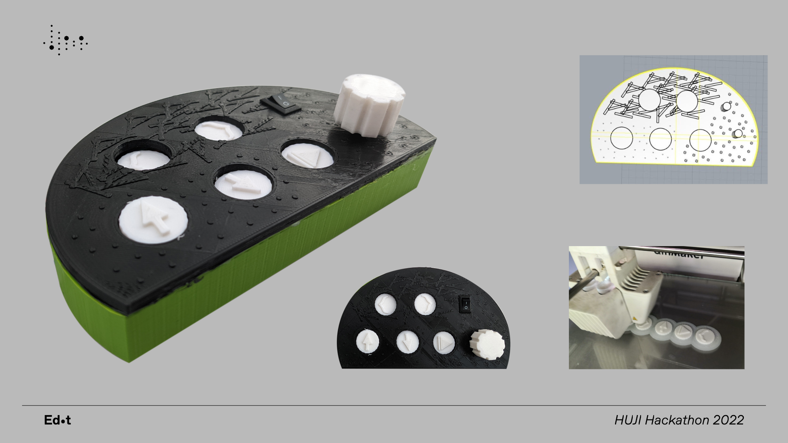

# Edot
An interactive accessible pad and software for vision impaired content creators.

This Project was created as part of the 2022 HUJI Hackathon

---

#### Technologies

- Arduino
- Proccessing 
- Adobe Creative Suite

#### Contributers

- https://github.com/OmriBenbenisty
- https://github.com/OmriBergman
- https://github.com/yuvalezrati
- https://github.com/talBrau

- Design: Nirel Reinshmidt

[Back To The Top](#read-me-template)
